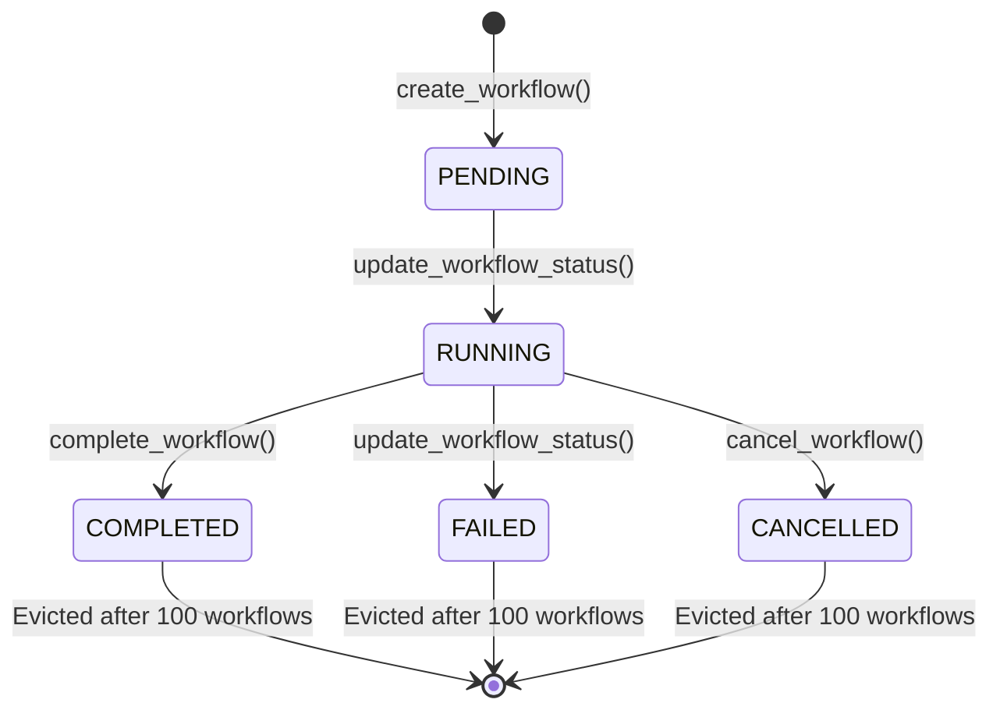

# MCP Orchestrator Server - Data Flow & State Management Analysis

**Analyzed by**: Luke Steuber
**Date**: 2025-11-18
**Version**: 1.0
**Files Analyzed**:
- `/home/coolhand/shared/mcp/unified_server.py` (WorkflowState class)
- `/home/coolhand/shared/mcp/streaming.py` (StreamingBridge, WebhookManager)
- `/home/coolhand/shared/orchestration/base_orchestrator.py`
- `/home/coolhand/shared/orchestration/models.py`

---

## Executive Summary

The MCP Orchestrator Server uses **in-memory state management** with no persistence layer. This design prioritizes simplicity and low latency but introduces significant data loss risks and scalability limitations. The system can handle concurrent orchestrations through async patterns, but lacks durability, queryability, and historical analytics capabilities.

### Critical Findings

1. **Data Loss Risk**: High - All workflow state is lost on server restart
2. **Memory Usage**: Bounded to 100 completed workflows, but active workflows are unbounded
3. **Persistence**: None - No database, no file storage for results
4. **Scalability**: Limited - Single-instance only, no horizontal scaling
5. **Analytics**: None - No historical querying or reporting capabilities

---

## 1. WorkflowState Class - In-Memory State Management

**Location**: `unified_server.py` lines 57-179

### Architecture Pattern

```python
class WorkflowState:
    def __init__(self):
        self.active_workflows: Dict[str, Dict[str, Any]] = {}
        self.completed_workflows: Dict[str, OrchestratorResult] = {}
        self.max_completed_retention = 100
```

**Pattern**: Simple in-memory dictionary-based state storage

### Data Structures

#### Active Workflows (`active_workflows`)
- **Type**: `Dict[task_id, workflow_info]`
- **Lifecycle**: Created on orchestration start → Retained until server restart
- **Size**: **Unbounded** - grows with concurrent orchestrations
- **Contents**:
  ```python
  {
      'task_id': str,
      'orchestrator_type': str,  # 'beltalowda' | 'swarm'
      'task': str,
      'status': TaskStatus,
      'created_at': ISO timestamp,
      'started_at': ISO timestamp,
      'completed_at': ISO timestamp,
      'config': dict,
      'error': Optional[str]
  }
  ```

#### Completed Workflows (`completed_workflows`)
- **Type**: `Dict[task_id, OrchestratorResult]`
- **Lifecycle**: Added on completion → Evicted after 100 entries (FIFO)
- **Size**: **Bounded to 100 entries** (lines 68, 143-149)
- **Eviction Strategy**: Remove oldest by execution_time (not creation time!)

### State Transitions



### Critical Code Analysis

**Lines 143-149: Cleanup Logic**
```python
if len(self.completed_workflows) > self.max_completed_retention:
    # Remove oldest by execution_time
    oldest = sorted(
        self.completed_workflows.items(),
        key=lambda x: x[1].execution_time
    )[0][0]
    del self.completed_workflows[oldest]
```

**Issues**:
1. Sorts by `execution_time` (duration), not `created_at` - **Wrong metric for FIFO**
2. O(n log n) sort on every completion - inefficient
3. No notification or archival before deletion

---

## 2. Data Retention Strategy

### Current Limits

| Category | Limit | Enforcement | Consequence |
|----------|-------|-------------|-------------|
| Active Workflows | **Unbounded** | None | Memory exhaustion possible |
| Completed Workflows | **100 max** | FIFO eviction | Data loss after 101st completion |
| Stream Events | **1000 per stream** | Queue size limit | Slow consumers lose events |
| Streaming TTL | **3600 seconds (1 hour)** | Background cleanup | Idle streams auto-close |

### Memory Footprint Estimation

**Per Active Workflow**:
- Workflow info: ~1 KB
- Config dict: ~0.5 KB
- **Total**: ~1.5 KB per active workflow

**Per Completed Workflow**:
- OrchestratorResult: ~10-50 KB (varies by agent count, synthesis length)
- Average: ~25 KB
- **100 workflows**: ~2.5 MB

**Per Stream Event**:
- Event dict: ~0.5-2 KB
- **1000 events**: ~1 MB per stream

**Concurrent Load Example**:
- 50 active workflows: 75 KB
- 100 completed workflows: 2.5 MB
- 20 active streams (1000 events each): 20 MB
- **Total**: ~22.6 MB (manageable)

**Problem**: Unbounded active workflows can grow indefinitely if workflows hang or run for days.

---

## 3. Streaming Event Flow (SSE + Webhooks)

### Architecture Overview

```
Orchestrator → StreamCallback → StreamingBridge → [SSE Clients + Webhooks]
                                        ↓
                                  asyncio.Queue (1000 max)
                                        ↓
                          [consume_stream() generator]
                                        ↓
                                  Client Browser
```

### StreamingBridge (`streaming.py` lines 27-259)

**Core Pattern**: Async queue-based pub/sub

```python
class StreamingBridge:
    active_streams: Dict[str, asyncio.Queue] = {}  # task_id → Queue
    stream_timestamps: Dict[str, float] = {}       # task_id → creation time
    max_streams: int = 100
    stream_ttl: int = 3600  # 1 hour
```

### Event Flow Lifecycle

1. **Stream Creation** (line 58):
   ```python
   queue = asyncio.Queue(maxsize=1000)  # Fixed size!
   ```

2. **Event Push** (line 103):
   ```python
   await queue.put(event)  # Blocks if queue full
   ```

3. **Event Consumption** (line 162):
   ```python
   async for event in bridge.consume_stream(task_id):
       yield f"data: {json.dumps(event)}\n\n"
   ```

4. **Stream Cleanup** (line 216):
   ```python
   if (now - timestamp) > self.stream_ttl:
       await self.close_stream(task_id)  # Auto-cleanup after 1 hour
   ```

### Webhook Delivery (`streaming.py` lines 262-455)

**Pattern**: Async HTTP POST with retry + exponential backoff

```python
class WebhookManager:
    registered_webhooks: Dict[str, str] = {}  # task_id → webhook_url
    delivery_count: defaultdict[int]          # task_id → count
    failure_count: defaultdict[int]           # task_id → count
    max_retries: int = 3
```

**Delivery Logic** (line 329):
1. POST event to webhook URL
2. HMAC signature verification (optional)
3. Retry 3x with exponential backoff (1s, 2s, 4s)
4. Track success/failure counts

**Persistence**: None - webhook registrations are in-memory only.

---

## 4. Result Serialization and Storage

### OrchestratorResult Structure

**From `models.py` lines 152-233**:

```python
@dataclass
class OrchestratorResult:
    task_id: str
    title: str
    status: TaskStatus
    agent_results: List[AgentResult]        # Unbounded!
    synthesis_results: List[SynthesisResult]
    final_synthesis: Optional[str]
    execution_time: float
    total_cost: float
    metadata: Dict[str, Any]
    generated_documents: List[Dict[str, Any]]
    artifacts: List[str]
    error: Optional[str]
```

**Size Considerations**:
- **agent_results**: Can grow to hundreds of entries (Beltalowda with 8+ agents)
- **final_synthesis**: Can be 10KB+ of text
- **generated_documents**: References to files (not file contents)

### Serialization Methods

1. **to_dict()** (line 183): Python dict conversion
   - Used for JSON responses
   - No compression or optimization

2. **get_content_sections()** (line 200): Document generation format
   - Flattens nested results for report generation
   - Not used for storage

### Storage: None

**Current state**: Results stored only in `WorkflowState.completed_workflows` dict.

**No serialization to**:
- ❌ Database
- ❌ File system
- ❌ Object storage
- ❌ Message queue

**Document generation** (line 447 in `base_orchestrator.py`):
- Generates PDF/DOCX/MD files to `config.output_directory`
- Files persist, but no database record of their metadata
- No indexing or retrieval mechanism beyond filesystem

---

## 5. Potential Data Loss Scenarios

### Severity Rating: **CRITICAL**

| Scenario | Likelihood | Impact | Data Lost |
|----------|-----------|--------|-----------|
| **Server Restart** | High | Critical | All active workflows, all completed workflows, all stream state |
| **Process Crash** | Medium | Critical | Same as above |
| **Memory Pressure OOM** | Low | Critical | Process killed, all state lost |
| **101st Workflow Completion** | High | Minor | Oldest completed workflow evicted |
| **Stream Queue Full** | Medium | Medium | New events dropped if client slow |
| **Stream TTL Expiry** | Medium | Minor | Stream closed after 1 hour idle |
| **Power Failure** | Low | Critical | Total state loss |
| **Docker Container Recreate** | High | Critical | All state lost (no volumes mounted) |

### Real-World Impact Examples

**Scenario 1: Server Deployment**
```bash
# User starts 5 long-running research tasks
$ curl -X POST /tools/orchestrate_research -d '{...}'  # task_1
$ curl -X POST /tools/orchestrate_research -d '{...}'  # task_2
...
# 10 minutes later, deploy new server version
$ systemctl restart mcp-server
# Result: All 5 tasks lost, users see 404 on status checks
```

**Scenario 2: Network Partition**
```python
# Webhook registered for task notifications
webhook_url = "https://client.example.com/webhook"

# Server restarts during task execution
# On restart:
# - Webhook registration lost (in-memory only)
# - Client never receives completion notification
# - No retry mechanism
```

**Scenario 3: High Load**
```python
# 150 research tasks complete in 1 hour
# First 50 results: Evicted silently
# User requests status of task_1 (completed 2 hours ago)
# Response: 404 - "No workflow found"
# No audit trail, no historical record
```

---

## 6. Memory Usage with Concurrent Orchestrations

### Concurrency Model

**Base Orchestrator** (`base_orchestrator.py` line 330):
```python
if self.config.parallel_execution:
    semaphore = asyncio.Semaphore(self.config.max_concurrent_agents)
    results = await asyncio.gather(*[execute_with_semaphore(st) for st in subtasks])
```

**Key Parameters**:
- `max_concurrent_agents`: Default 10 (per workflow)
- `parallel_execution`: Default True
- **Server-wide concurrency**: Unbounded (no global semaphore)

### Memory Scaling Analysis

**Single Beltalowda Workflow**:
- 8 Belter agents (default)
- 2 Drummer agents (mid-synthesis)
- 1 Camina agent (executive)
- **Total**: 11 agents × ~25 KB per result = **275 KB**

**10 Concurrent Workflows**:
- 10 workflows × 275 KB = **2.75 MB**
- Stream queues: 10 × 1 MB = **10 MB**
- **Total**: ~12.75 MB

**100 Concurrent Workflows** (stress test):
- 100 workflows × 275 KB = **27.5 MB**
- Stream queues: 100 × 1 MB = **100 MB**
- **Total**: ~127.5 MB

**Bottleneck**: Not memory, but **CPU/API rate limits** (LLM calls).

### Resource Exhaustion Risks

1. **API Rate Limits**: xAI/OpenAI concurrent request limits
2. **Network Connections**: aiohttp connection pool limits
3. **Event Loop Saturation**: Too many pending coroutines
4. **Disk I/O**: Document generation writes (unbounded)

**Mitigation**: Global concurrency limit needed.

---

## 7. Opportunities for Redis/Persistent State

### Why Redis?

**Advantages**:
1. **Persistence**: RDB/AOF snapshots survive restarts
2. **Atomic Operations**: INCR, SETEX, transactions
3. **TTL Support**: Native expiration (aligns with current design)
4. **Pub/Sub**: Alternative to in-memory queues
5. **Scalability**: Multi-instance support via shared state
6. **Queryability**: SCAN, pattern matching, sorted sets

**Library Available**: `/home/coolhand/shared/memory/RedisManager` already implemented!

### Recommended Redis Schema

#### Workflow State
```python
# Active workflows
redis.hset(f"workflow:{task_id}", mapping={
    "orchestrator_type": "beltalowda",
    "task": "...",
    "status": "running",
    "created_at": timestamp,
    "config": json.dumps(config)
})
redis.expire(f"workflow:{task_id}", 86400)  # 24 hour TTL

# Index by status
redis.sadd("workflows:active", task_id)
redis.sadd("workflows:completed", task_id)
```

#### Completed Results
```python
# Store result as compressed JSON
result_json = json.dumps(orchestrator_result.to_dict())
redis.set(
    f"result:{task_id}",
    zlib.compress(result_json.encode()),
    ex=86400 * 7  # 7 day retention
)

# Sorted set for time-based queries
redis.zadd("results:by_time", {task_id: timestamp})
redis.zremrangebyrank("results:by_time", 0, -101)  # Keep last 100
```

#### Streaming Events
```python
# Use Redis Streams for event log
redis.xadd(
    f"stream:{task_id}",
    {"event_type": "agent_complete", "data": json.dumps(data)},
    maxlen=1000  # Match current queue size
)

# Consumer groups for multi-client support
redis.xgroup_create(f"stream:{task_id}", "clients", mkstream=True)
```

#### Webhooks
```python
# Persistent webhook registry
redis.hset(f"webhooks:{task_id}", "url", webhook_url)
redis.expire(f"webhooks:{task_id}", 86400)

# Delivery tracking
redis.hincrby(f"webhook_stats:{task_id}", "deliveries", 1)
redis.hincrby(f"webhook_stats:{task_id}", "failures", 1)
```

### Migration Path

**Phase 1: Dual-Write Pattern**
```python
class WorkflowState:
    def __init__(self, redis_client=None):
        self.redis = redis_client
        self.active_workflows = {}  # Keep for read cache

    def create_workflow(self, task_id, ...):
        # Write to memory (fast)
        self.active_workflows[task_id] = workflow_info

        # Write to Redis (durable)
        if self.redis:
            self.redis.hset(f"workflow:{task_id}", mapping=workflow_info)
```

**Phase 2: Read-Through Cache**
```python
def get_workflow_info(self, task_id):
    # Check memory cache first
    if task_id in self.active_workflows:
        return self.active_workflows[task_id]

    # Fall back to Redis
    if self.redis:
        data = self.redis.hgetall(f"workflow:{task_id}")
        if data:
            self.active_workflows[task_id] = data  # Warm cache
            return data

    return None
```

**Phase 3: Redis-First**
```python
# Remove in-memory dicts entirely, use Redis as source of truth
def create_workflow(self, task_id, ...):
    self.redis.hset(f"workflow:{task_id}", mapping=workflow_info)
    self.redis.sadd("workflows:active", task_id)
```

### Estimated Implementation Effort

| Component | Effort | Risk |
|-----------|--------|------|
| RedisManager integration | 2 hours | Low |
| Workflow state migration | 4 hours | Medium |
| Result storage | 3 hours | Low |
| Streaming events (Redis Streams) | 6 hours | High |
| Webhook persistence | 2 hours | Low |
| Testing | 8 hours | Medium |
| **Total** | **25 hours** | **Medium** |

---

## 8. Data Migration Paths for Results/History

### Option A: SQLite (Lightweight)

**Pros**:
- Single file database (`/home/coolhand/shared/mcp/orchestrator.db`)
- No external dependencies
- ACID transactions
- SQL queries for analytics
- Built-in Python support

**Cons**:
- Single-writer bottleneck
- No distributed/multi-instance support
- File locking issues on NFS

**Schema**:
```sql
CREATE TABLE workflows (
    task_id TEXT PRIMARY KEY,
    orchestrator_type TEXT NOT NULL,
    task TEXT NOT NULL,
    status TEXT NOT NULL,
    created_at TIMESTAMP NOT NULL,
    started_at TIMESTAMP,
    completed_at TIMESTAMP,
    config JSON,
    error TEXT
);

CREATE TABLE results (
    task_id TEXT PRIMARY KEY,
    result JSON NOT NULL,  -- Full OrchestratorResult
    execution_time REAL,
    total_cost REAL,
    created_at TIMESTAMP NOT NULL,
    FOREIGN KEY (task_id) REFERENCES workflows(task_id)
);

CREATE TABLE events (
    id INTEGER PRIMARY KEY AUTOINCREMENT,
    task_id TEXT NOT NULL,
    event_type TEXT NOT NULL,
    event_data JSON,
    timestamp TIMESTAMP NOT NULL,
    FOREIGN KEY (task_id) REFERENCES workflows(task_id)
);

CREATE INDEX idx_workflows_status ON workflows(status);
CREATE INDEX idx_workflows_created ON workflows(created_at);
CREATE INDEX idx_events_task_time ON events(task_id, timestamp);
```

**Usage**:
```python
import sqlite3
import json

class PersistentWorkflowState:
    def __init__(self, db_path="/home/coolhand/shared/mcp/orchestrator.db"):
        self.conn = sqlite3.connect(db_path, check_same_thread=False)
        self.conn.row_factory = sqlite3.Row
        self._init_schema()

    def create_workflow(self, task_id, orchestrator_type, task, config):
        self.conn.execute(
            "INSERT INTO workflows (task_id, orchestrator_type, task, status, created_at, config) "
            "VALUES (?, ?, ?, ?, ?, ?)",
            (task_id, orchestrator_type, task, "pending", datetime.utcnow(), json.dumps(config.to_dict()))
        )
        self.conn.commit()

    def complete_workflow(self, task_id, result):
        self.conn.execute(
            "UPDATE workflows SET status = ?, completed_at = ? WHERE task_id = ?",
            (result.status.value, datetime.utcnow(), task_id)
        )
        self.conn.execute(
            "INSERT INTO results (task_id, result, execution_time, total_cost, created_at) "
            "VALUES (?, ?, ?, ?, ?)",
            (task_id, json.dumps(result.to_dict()), result.execution_time, result.total_cost, datetime.utcnow())
        )
        self.conn.commit()
```

### Option B: PostgreSQL (Production-Grade)

**Pros**:
- True ACID compliance
- Multi-instance support
- Advanced querying (JSONB, full-text search)
- Built-in replication
- Industry standard

**Cons**:
- External service dependency
- Higher complexity
- Requires credentials/connection pool

**Docker Setup**:
```bash
docker run -d \
  --name mcp-postgres \
  -e POSTGRES_DB=mcp_orchestrator \
  -e POSTGRES_USER=mcp \
  -e POSTGRES_PASSWORD=secure_password \
  -p 5432:5432 \
  -v /var/lib/postgresql/data:/var/lib/postgresql/data \
  postgres:15
```

**Schema** (similar to SQLite, but with JSONB):
```sql
CREATE TABLE workflows (
    task_id TEXT PRIMARY KEY,
    orchestrator_type TEXT NOT NULL,
    task TEXT NOT NULL,
    status TEXT NOT NULL,
    created_at TIMESTAMPTZ NOT NULL DEFAULT NOW(),
    started_at TIMESTAMPTZ,
    completed_at TIMESTAMPTZ,
    config JSONB,
    error TEXT
);

CREATE TABLE results (
    task_id TEXT PRIMARY KEY,
    result JSONB NOT NULL,
    execution_time REAL,
    total_cost REAL,
    created_at TIMESTAMPTZ NOT NULL DEFAULT NOW(),
    FOREIGN KEY (task_id) REFERENCES workflows(task_id) ON DELETE CASCADE
);

-- JSONB index for fast queries
CREATE INDEX idx_results_metadata ON results USING GIN (result);
```

**Queries**:
```sql
-- Find all failed Beltalowda workflows
SELECT task_id, task, error
FROM workflows
WHERE orchestrator_type = 'beltalowda' AND status = 'failed';

-- Top 10 most expensive workflows
SELECT task_id, total_cost, execution_time
FROM results
ORDER BY total_cost DESC
LIMIT 10;

-- Workflows completed in last 24 hours
SELECT COUNT(*) FROM workflows
WHERE completed_at > NOW() - INTERVAL '24 hours';

-- Average execution time by orchestrator type
SELECT
    w.orchestrator_type,
    AVG(r.execution_time) as avg_time,
    AVG(r.total_cost) as avg_cost
FROM workflows w
JOIN results r ON w.task_id = r.task_id
GROUP BY w.orchestrator_type;
```

### Option C: Hybrid (Redis + PostgreSQL)

**Best of Both Worlds**:
- **Redis**: Hot data (active workflows, streaming events)
- **PostgreSQL**: Cold data (completed results, analytics)

**Architecture**:
```
Active Workflow → Redis (in-memory, fast)
       ↓
   Completion
       ↓
PostgreSQL (persistent, queryable) + Redis (7-day cache)
       ↓
   After 7 days
       ↓
PostgreSQL only (cold storage)
```

**Code**:
```python
class HybridWorkflowState:
    def __init__(self, redis_client, postgres_conn):
        self.redis = redis_client
        self.pg = postgres_conn

    def create_workflow(self, task_id, ...):
        # Write to Redis for fast access
        self.redis.hset(f"workflow:{task_id}", mapping=workflow_info)
        self.redis.expire(f"workflow:{task_id}", 86400)  # 24h TTL

        # Async write to Postgres for durability
        asyncio.create_task(self._persist_to_postgres(task_id, workflow_info))

    def complete_workflow(self, task_id, result):
        # Write result to Postgres immediately
        self.pg.execute(
            "INSERT INTO results (task_id, result, ...) VALUES (...)"
        )

        # Cache in Redis for 7 days
        self.redis.set(
            f"result:{task_id}",
            json.dumps(result.to_dict()),
            ex=86400 * 7
        )

    def get_workflow_result(self, task_id):
        # Try Redis cache first
        cached = self.redis.get(f"result:{task_id}")
        if cached:
            return json.loads(cached)

        # Fall back to Postgres
        row = self.pg.execute(
            "SELECT result FROM results WHERE task_id = ?",
            (task_id,)
        ).fetchone()

        if row:
            # Warm cache
            self.redis.set(f"result:{task_id}", row['result'], ex=86400 * 7)
            return json.loads(row['result'])

        return None
```

---

## 9. Recommendations for Data Durability, Querying, and Analytics

### Priority 1: Immediate Fixes (1-2 days)

1. **Fix Eviction Bug** (Line 143-149 in `unified_server.py`)
   ```python
   # BEFORE (sorts by execution_time - duration)
   oldest = sorted(self.completed_workflows.items(),
                   key=lambda x: x[1].execution_time)[0][0]

   # AFTER (sorts by completion timestamp)
   oldest = min(self.completed_workflows.items(),
                key=lambda x: x[1].metadata.get('completed_at', 0))[0]
   ```

2. **Add Active Workflow Limit**
   ```python
   MAX_ACTIVE_WORKFLOWS = 50  # Prevent unbounded growth

   def create_workflow(self, ...):
       if len(self.active_workflows) >= MAX_ACTIVE_WORKFLOWS:
           raise ValueError("Max active workflows exceeded. Wait for tasks to complete.")
   ```

3. **Implement Graceful Shutdown**
   ```python
   import signal
   import json

   def save_state_on_shutdown(signum, frame):
       """Save workflow state to disk before exit."""
       state_file = "/home/coolhand/shared/mcp/state_backup.json"
       with open(state_file, 'w') as f:
           json.dump({
               'active_workflows': self.active_workflows,
               'completed_workflows': {
                   k: v.to_dict() for k, v in self.completed_workflows.items()
               }
           }, f)
       logger.info(f"State saved to {state_file}")
       sys.exit(0)

   signal.signal(signal.SIGTERM, save_state_on_shutdown)
   signal.signal(signal.SIGINT, save_state_on_shutdown)
   ```

### Priority 2: Redis Integration (1 week)

**Goal**: Survive restarts, enable multi-instance deployment

**Implementation**:
1. Add Redis to `unified_server.py`:
   ```python
   from shared.memory import RedisManager

   class WorkflowState:
       def __init__(self, redis_enabled=True):
           self.redis = None
           if redis_enabled:
               try:
                   self.redis = RedisManager()
               except Exception as e:
                   logger.warning(f"Redis unavailable: {e}. Using in-memory only.")
   ```

2. Implement dual-write pattern (see Section 7)

3. Add Redis health check to `/health` endpoint

4. Document Redis setup in README

**Deliverables**:
- [ ] Redis integration PR
- [ ] Migration script for existing deployments
- [ ] Updated Docker Compose with Redis service
- [ ] Performance benchmarks (memory vs Redis)

### Priority 3: PostgreSQL Analytics (2 weeks)

**Goal**: Historical querying, reporting dashboards

**Implementation**:
1. Choose lightweight ORM (SQLAlchemy or raw SQL)
2. Create schema (see Option B in Section 8)
3. Build async writer to prevent blocking
4. Add analytics endpoints:
   ```python
   @app.route('/analytics/summary')
   def analytics_summary():
       """Get workflow statistics."""
       return {
           'total_workflows': db.count_all_workflows(),
           'success_rate': db.success_rate(days=7),
           'avg_execution_time': db.avg_execution_time(),
           'total_cost': db.total_cost(days=30)
       }
   ```

5. Build admin dashboard (optional)

**Deliverables**:
- [ ] PostgreSQL schema DDL
- [ ] Async writer service
- [ ] Analytics API endpoints
- [ ] Grafana/Metabase dashboard templates

### Priority 4: Advanced Features (1 month)

1. **Workflow Resumption**
   - Store intermediate state in Redis/Postgres
   - Resume failed workflows from last checkpoint
   - Agent-level retry with state persistence

2. **Audit Logging**
   - Log all state changes to immutable event store
   - Compliance tracking (GDPR, SOC2)
   - Replay capability for debugging

3. **Multi-Instance Support**
   - Redis-based distributed locks
   - Task queue (Celery/RQ) for worker pool
   - Sticky sessions for SSE streams

4. **Cost Optimization**
   - Archive old results to S3/MinIO
   - Compress large result payloads (gzip/zstd)
   - TTL-based automatic cleanup

5. **Observability**
   - OpenTelemetry tracing (already in `/home/coolhand/shared/observability/`)
   - Prometheus metrics export
   - Structured logging (JSON format)

---

## 10. Quick Win Implementation: 48-Hour Plan

### Hour 0-4: Redis Integration

**File**: `/home/coolhand/shared/mcp/unified_server.py`

```python
# Add at top
from shared.memory import RedisManager

class WorkflowState:
    def __init__(self, redis_enabled=True):
        self.active_workflows: Dict[str, Dict[str, Any]] = {}
        self.completed_workflows: Dict[str, OrchestratorResult] = {}
        self.max_completed_retention = 100

        # NEW: Redis integration
        self.redis = None
        if redis_enabled:
            try:
                self.redis = RedisManager()
                logger.info("Redis connected for persistent state")
            except Exception as e:
                logger.warning(f"Redis unavailable, using memory-only: {e}")

    def create_workflow(self, task_id, orchestrator_type, task, config):
        # Existing memory write
        workflow_info = {...}
        self.active_workflows[task_id] = workflow_info

        # NEW: Redis persistence
        if self.redis:
            try:
                self.redis.set(
                    f"workflow:{task_id}",
                    workflow_info,
                    ttl=86400  # 24 hour retention
                )
                self.redis.client.sadd("workflows:active", task_id)
            except Exception as e:
                logger.error(f"Redis write failed: {e}")

        return workflow_info

    def complete_workflow(self, task_id, result):
        # Existing memory write
        self.update_workflow_status(task_id, result.status)
        self.completed_workflows[task_id] = result

        # NEW: Redis persistence
        if self.redis:
            try:
                # Store result
                self.redis.set(
                    f"result:{task_id}",
                    result.to_dict(),
                    ttl=86400 * 7  # 7 day retention
                )

                # Update indexes
                self.redis.client.srem("workflows:active", task_id)
                self.redis.client.sadd("workflows:completed", task_id)

                # Sorted set for time-based queries
                self.redis.client.zadd(
                    "results:by_time",
                    {task_id: time.time()}
                )

                # Cleanup: keep last 100 in sorted set
                self.redis.client.zremrangebyrank("results:by_time", 0, -101)

            except Exception as e:
                logger.error(f"Redis result write failed: {e}")

        # Existing cleanup logic (FIX THE BUG!)
        if len(self.completed_workflows) > self.max_completed_retention:
            # FIXED: Sort by completion time, not execution duration
            oldest_task_id = min(
                self.completed_workflows.keys(),
                key=lambda tid: self.completed_workflows[tid].metadata.get('completed_at', '')
            )
            del self.completed_workflows[oldest_task_id]

    def get_workflow_result(self, task_id):
        # Try memory cache first
        if task_id in self.completed_workflows:
            return self.completed_workflows[task_id]

        # NEW: Try Redis
        if self.redis:
            try:
                result_dict = self.redis.get(f"result:{task_id}")
                if result_dict:
                    # Reconstruct OrchestratorResult from dict
                    # (Need to implement from_dict() method)
                    return result_dict  # Return dict for now
            except Exception as e:
                logger.error(f"Redis read failed: {e}")

        return None
```

**Test**:
```bash
# Start Redis
docker run -d --name mcp-redis -p 6379:6379 redis:7

# Restart MCP server
systemctl restart mcp-server

# Verify persistence
redis-cli KEYS "workflow:*"
redis-cli SMEMBERS "workflows:active"
```

### Hour 4-8: Add Analytics Endpoints

**File**: `/home/coolhand/shared/mcp/app.py`

```python
@app.route('/analytics/workflows')
def analytics_workflows():
    """Get workflow statistics from Redis."""
    redis = get_streaming_bridge().redis  # Assuming we add redis to bridge

    if not redis:
        return jsonify({'error': 'Redis not available'}), 503

    try:
        active_count = redis.client.scard("workflows:active")
        completed_count = redis.client.scard("workflows:completed")

        # Recent workflows (last 24 hours)
        now = time.time()
        yesterday = now - 86400
        recent_tasks = redis.client.zrangebyscore(
            "results:by_time",
            yesterday,
            now
        )

        return jsonify({
            'active_workflows': active_count,
            'completed_workflows': completed_count,
            'recent_24h': len(recent_tasks),
            'recent_task_ids': recent_tasks[:10]  # First 10
        })

    except Exception as e:
        return jsonify({'error': str(e)}), 500


@app.route('/analytics/costs')
def analytics_costs():
    """Calculate total costs from completed workflows."""
    workflows = mcp_server.workflow_state.completed_workflows

    total_cost = sum(w.total_cost for w in workflows.values())
    avg_cost = total_cost / len(workflows) if workflows else 0

    return jsonify({
        'total_cost_usd': round(total_cost, 4),
        'average_cost_usd': round(avg_cost, 4),
        'workflow_count': len(workflows)
    })
```

---

## 11. Conclusion

### Current State Assessment

**Strengths**:
- ✅ Simple, easy to understand
- ✅ Low latency (all in-memory)
- ✅ Async-friendly design
- ✅ Good streaming architecture

**Critical Weaknesses**:
- ❌ **No durability** - all state lost on restart
- ❌ **Limited retention** - only 100 completed workflows
- ❌ **No analytics** - can't query historical data
- ❌ **Single-instance only** - can't scale horizontally
- ❌ **Data loss bug** - incorrect eviction sorting

### Recommended Architecture (6-Month Vision)

```
┌─────────────────────────────────────────────────────────────┐
│                    MCP Orchestrator Cluster                  │
├─────────────────────────────────────────────────────────────┤
│                                                               │
│  ┌──────────┐  ┌──────────┐  ┌──────────┐                  │
│  │ Instance │  │ Instance │  │ Instance │                  │
│  │    1     │  │    2     │  │    3     │                  │
│  └────┬─────┘  └────┬─────┘  └────┬─────┘                  │
│       │             │             │                          │
│       └──────────┬──┴──────┬──────┘                         │
│                  │         │                                 │
│         ┌────────▼───┐  ┌──▼──────────┐                    │
│         │   Redis    │  │ PostgreSQL  │                    │
│         │ (Hot Data) │  │(Cold Data)  │                    │
│         └────────────┘  └─────────────┘                    │
│                                                               │
│         ┌────────────────────────────┐                      │
│         │     S3/MinIO Archive       │                      │
│         │  (Long-term storage >90d)  │                      │
│         └────────────────────────────┘                      │
└─────────────────────────────────────────────────────────────┘
```

**Data Tiers**:
1. **Memory** (0-5 min): Active orchestrations
2. **Redis** (5 min - 7 days): Recent results, hot cache
3. **PostgreSQL** (7 days - 90 days): Queryable history
4. **S3/MinIO** (90+ days): Cold archive, compliance

### Next Steps

1. **Immediate** (This Week):
   - Fix eviction bug
   - Add active workflow limit
   - Implement graceful shutdown

2. **Short-term** (This Month):
   - Integrate Redis (dual-write pattern)
   - Add basic analytics endpoints
   - Document deployment with Redis

3. **Medium-term** (3 Months):
   - PostgreSQL integration
   - Build admin dashboard
   - Implement workflow resumption

4. **Long-term** (6 Months):
   - Multi-instance support
   - Cost optimization (archival)
   - Advanced observability

---

**Document Version**: 1.0
**Last Updated**: 2025-11-18
**Author**: Luke Steuber
**Review Status**: Ready for Implementation
